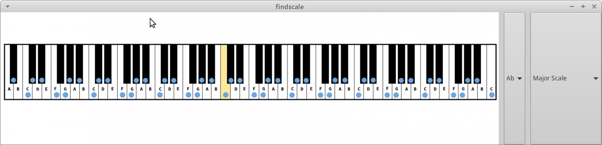

# findscale #

Simple gtk-based application that will display any musical scale in any key on instrument(s). I find this useful for improvising over a chord progression in some key I am unfamiliar with. Initially the only instrument will be piano, but will eventually add guitar and maybe some others.

 

- using gtk + cairo

## To do's ##

- ~~finish scale overlaying by note. (mostly just need to finish overlays for black keys)~~ **DONE**
- ~~implement method for inputting a custom scale.~~ **DONE**
- ~~Clean up the closing process~~ **DONE**

- ~~Create widget to select different scales at a given key.~~ **DONE**
- ~~Create widget to make key note changable.~~ **DONE**
- Clean up `free`ing of various memory structures.
  - Valgrind analysis
  
## To Build ##
```
cd findscale/src/ && gcc -o findscale findscale.c `pkg-config --cflags --libs gtk+-3.0`
```
## Usage ##
goto findscale/src run
```
./findscale
```
and enjoy, coming weeks or so will get around to making it so you do not need to open terminal in order to run it, as well as an make install script. But first need to do some code clean up.

## Tools - NO LONGER RELEVANT
This section is more for my own reference, but maybe others will find it useful
too.

To generate a compilation database suitable for use with editor tools such as 
ccls, irony-mode, etc.

Goto the `findscale/` directory, use 
[compiledb](https://github.com/nickdiego/compiledb) tool; run
```
compiledb make
```
This will create an initial `compile_commands.json` which, for some tools may be 
enough and no further work may be necessary. However I haven't found this to be
the case. Luckily, there is another tool to fixup `compile_commands.json`.

[compdb](https://github.com/Sarcasm/compdb) tool.
Use `compdb` to process the initial `compile_commands.json` produced by 
`compiledb` and you will end up with a `compile_commands.json` suitable for 
parsing by [ccls](https://github.com/MaskRay/ccls)
just run;
```
compdb -p . list > tmp && mv tmp compile_commands.json
```

Using `ccls` on ubuntu...

I use `ccls` on ubuntu and have the following in my `.ccls` file:

```
%compile_commands.json
%c -std=c11
%c --gcc-toolchain=/usr
%c -I/usr/lib/gcc/x86_64-linux-gnu/7/include
```

The include line `%c -I/usr/lib/gcc/x86_64-linux-gnu/7/include` is needed for
`ccls` to find some of the libc headers (I was getting errors telling me 
`size_t` was an invalid type). To find the appropriate `-I` for your system if
you run into such errors is `gcc --print-file-name=include`.
