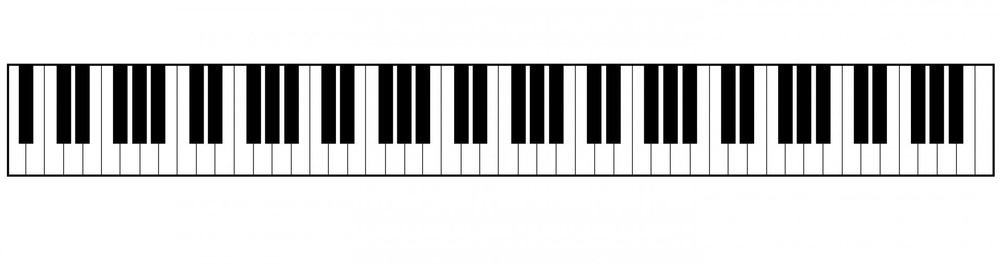

# findscale #

Simple gtk-based application that will display any musical scale in any key on instrument(s). I find this useful for improvising over a chord progression in some key I am unfamiliar with. Initially the only instrument will be piano, but will eventually add guitar and maybe some others.

 

- using gtk + cairo

## TODO's ##

- finish scale overlaying by note.
- implement method for inputting a custom scale.

