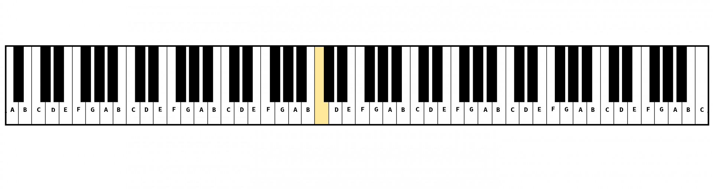
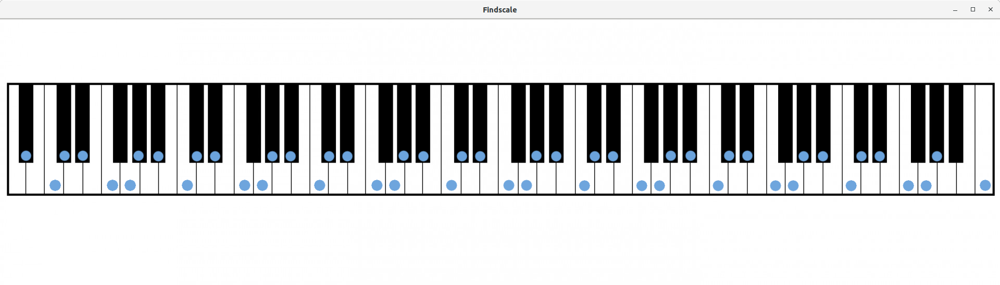

# findscale #

Simple gtk-based application that will display any musical scale in any key on instrument(s). I find this useful for improvising over a chord progression in some key I am unfamiliar with. Initially the only instrument will be piano, but will eventually add guitar and maybe some others.

 


- using gtk + cairo

## To do's ##

- ~~finish scale overlaying by note. (mostly just need to finish overlays for black keys)~~ **DONE**
- ~~implement method for inputting a custom scale.~~ **DONE**

- Create widget to select different scales at a given key.
- Create widget to make key note changable.
- Clean up the closing process (not require `ctrl + c` to exit)
- Clean up `free`ing of various memory structures.
  - Valgrind analysis

## Usage ##

Currently must run the program as follows
```
./findscale piano <Key>
```
so for example, running `./findscale piano Ab` will result in,



__findscale__ will only display the 1st scale listed in the config file found at `findscale/src/conf/scale.list` (selectable scale widget to be added later). So for example since the scale interval pattern corresponding to the major scale is listed first in `scale.list` that is the scale that is displayed above for the key `Ab`.

It should also be noted that the `<Key>` passed as an argument to findscale can only be one of the following. `Ab, A, Bb, B, C, Db, D, Eb, E, F, Gb, G`.

